# Access Control Plan for FloorPlan 
## Application
Please download it from the [google drive](https://drive.google.com/file/d/1_1-UIt8joyS_FvTtRm-VquuRjBkGcPRv/view?usp=sharing) to test your own floorplan images.

## Processes
1. Use [DataFloorPlans500](https://universe.roboflow.com/university-y9nbi/floor-plans-500/dataset/3) to train the first object recognition model. Since the data is not fully suitable on our usecase. This model is just for labeling our own data. The following images show some fail cases of this model on our dataset (ROBIN). [Yolov8](https://github.com/ultralytics/ultralytics) is used in this task.
    - Table Recognized as Door: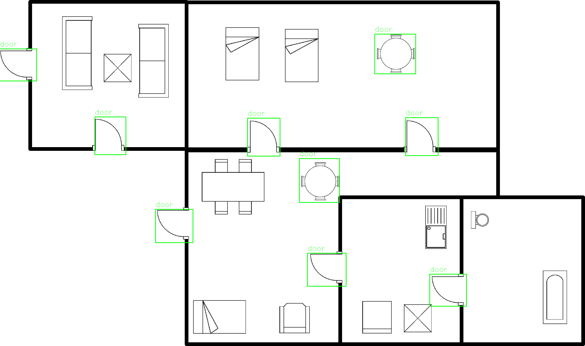
    - Sink Recognized as Door: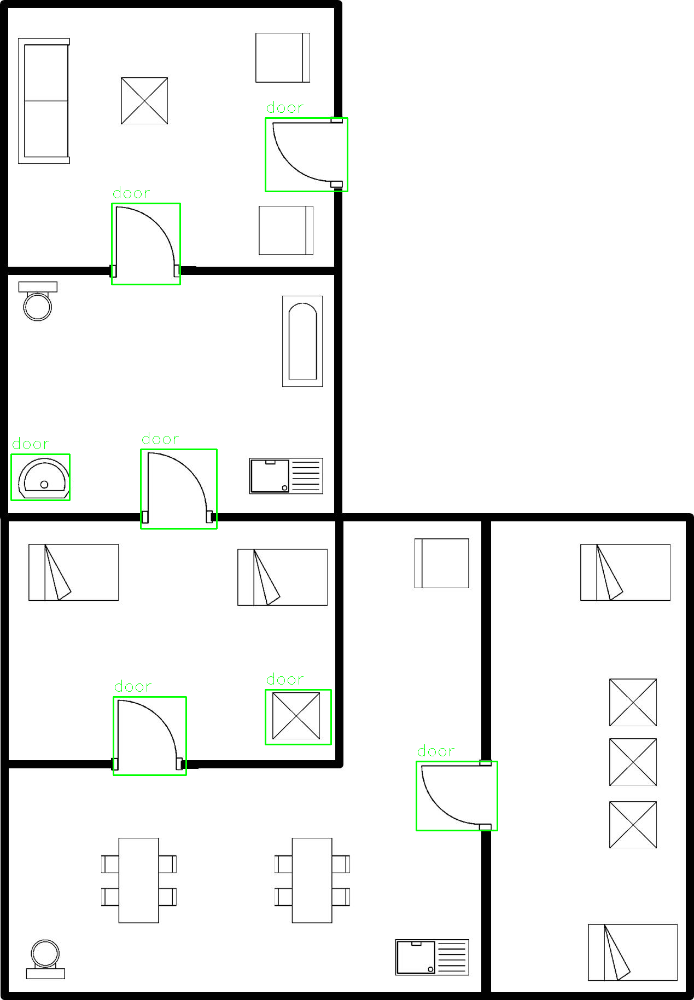
    - Door not Recognized: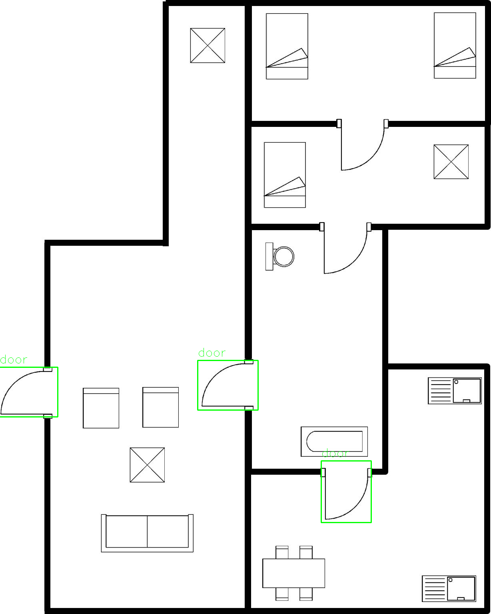
    
2. Use frist objection model to do the labeling with manual adjustment and train the second model based on our data format: [ROBIN](https://github.com/gesstalt/ROBIN). The manual adjusted data is at [google drive](https://drive.google.com/file/d/1hs6Qc2UjLSYC5Q9rDbENUcZDAgnrkf5y/view?usp=sharing), which can be put on the `FloorPlan/ROBIN/ROBIN_Door_15_Labeled`. The following images show the improvements of the 2nd model from the first model. [Yolov8](https://github.com/ultralytics/ultralytics) is used in this task.
    - (Fixed) Table Recognized as Door: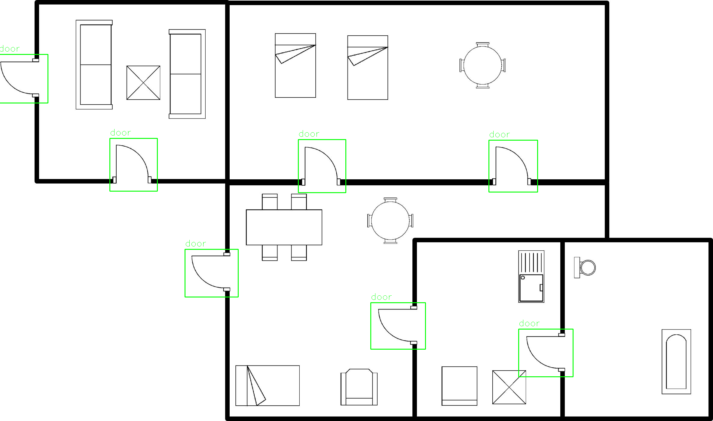
    - (Fixed) Sink Recognized as Door: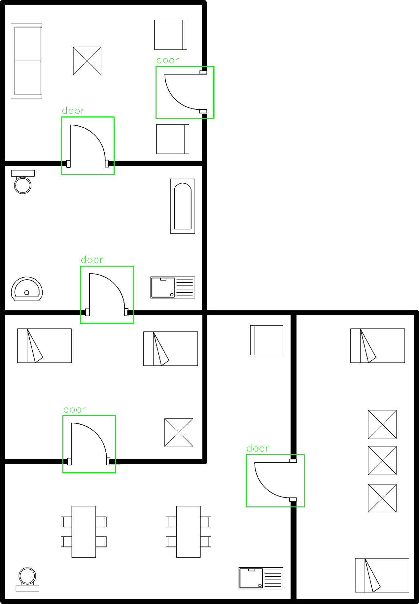
    - (Fixed) Door not Recognized: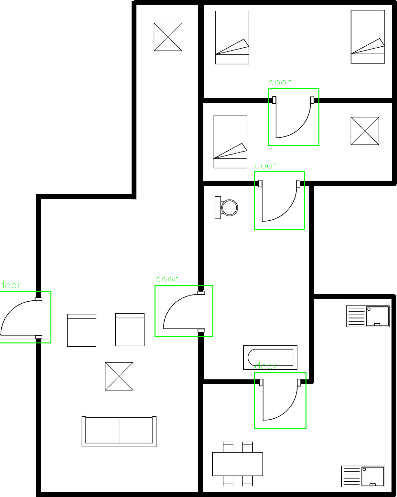

3. Use Traditional CV method to help Annotation the location of the door
    - Normal: 
        - 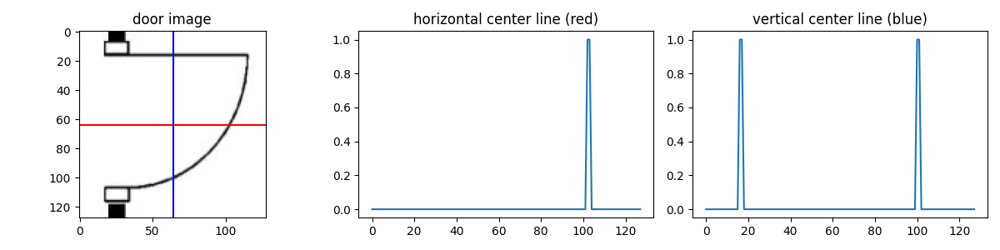
        - 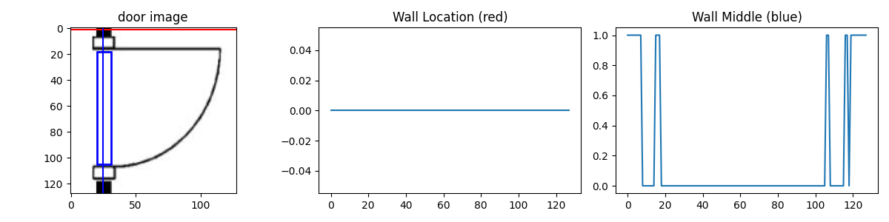       
    - Fail Case1 (Door Area Too Big):
        - 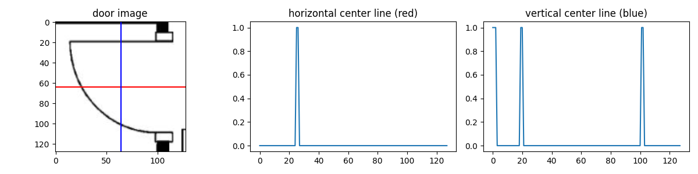
        - 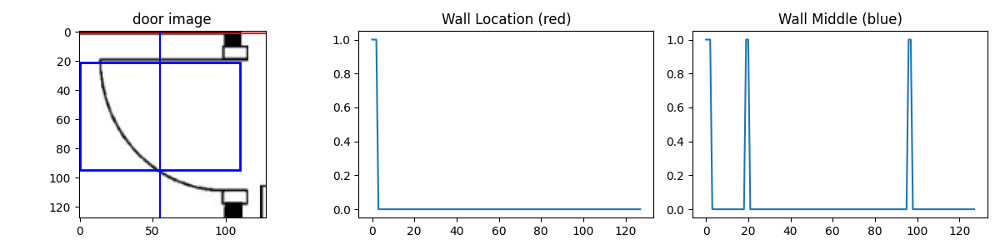       
    - Fail Case2 (Door Area Too Big):
        - 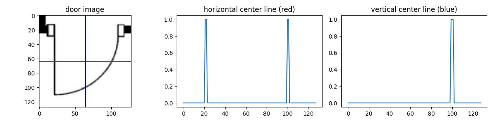
        - 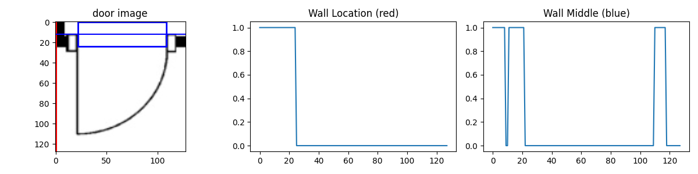       
    - Fail Case3 (Fail to Find Orientation):
        - 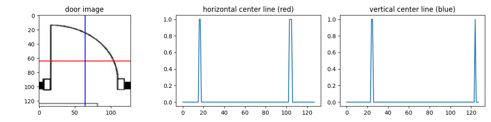
    - Fail Case4 (Fail to Find Orientation):
        - 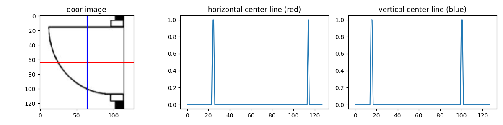       
        
4. Train the segmentation model to recognize the orientation of the door. The labeled dataset can be found at [google drive](https://drive.google.com/file/d/19rZ_CDH-WnGSQ_RE2iyY9PHb90tbEU1N/view?usp=sharing). The training code can be found in `FloorPlan/DoorOrientationSegmentation`. The UNet architecture is used in this task.
    - Labeled Data: 
        - 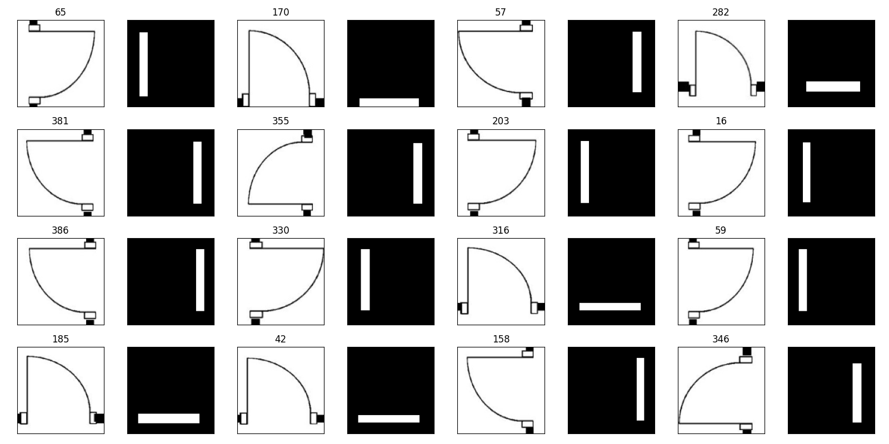   
    - Augmentation: This techniques are used to enhance the generalizability of the model.
        - 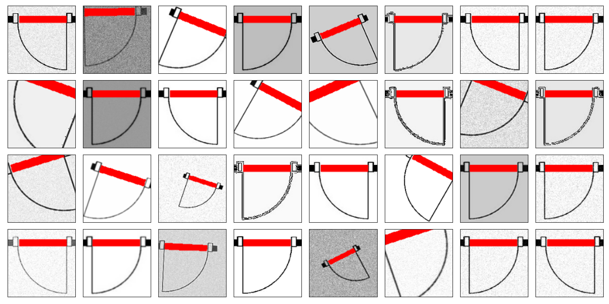
    - Model Prediction: The Red is the predicted location of the door. The blue is the labeled location of the door. Since they are almost overlapped, the blue lines are usually not visible.
        - 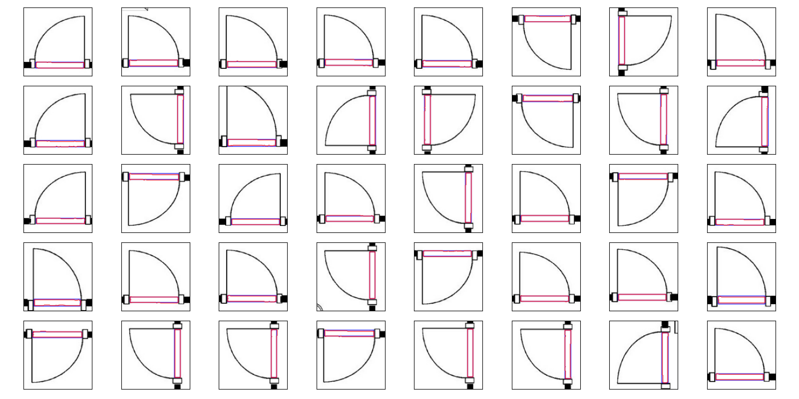
    
5. Local Camera and Card Reader Location.
    - Prediction1: 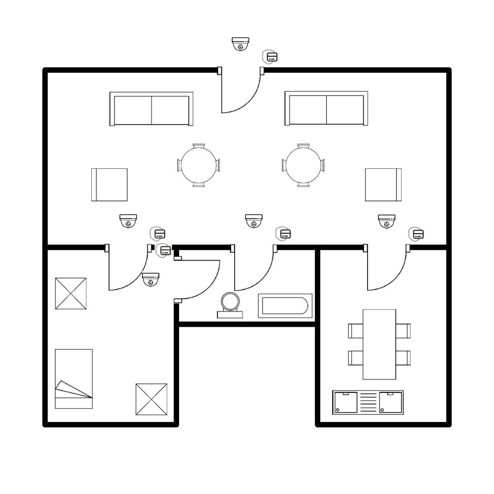
    - Prediction2: 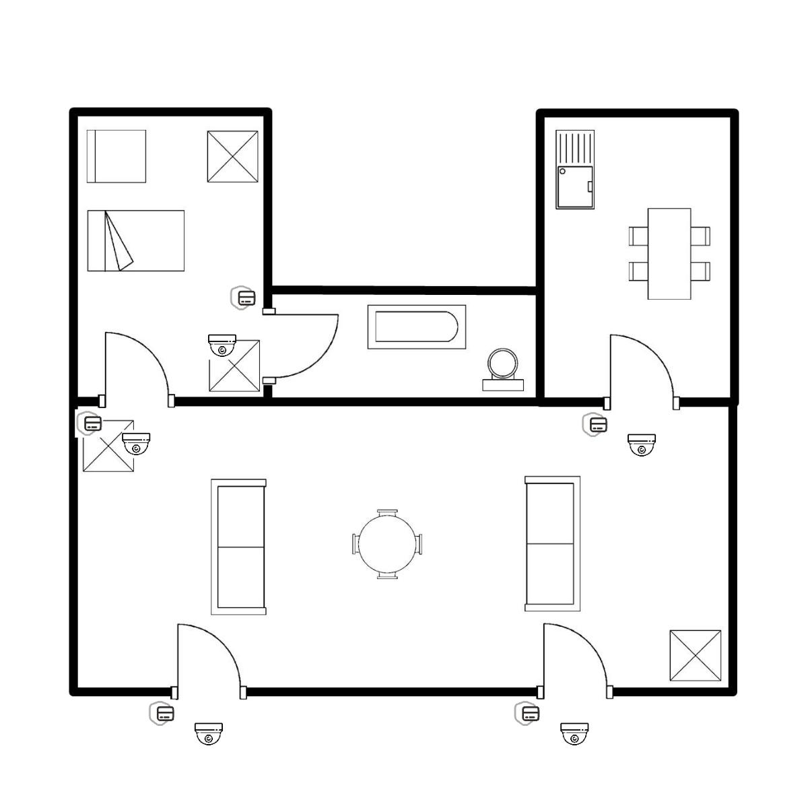

    
